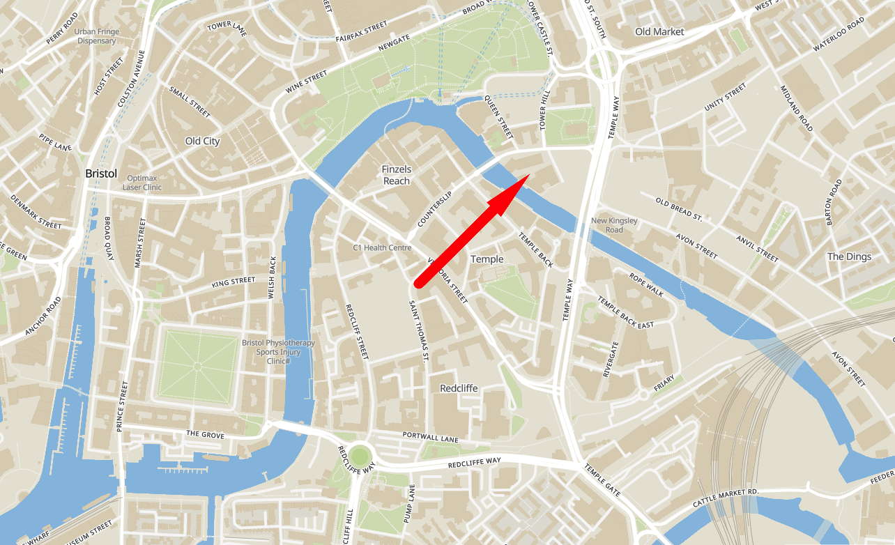
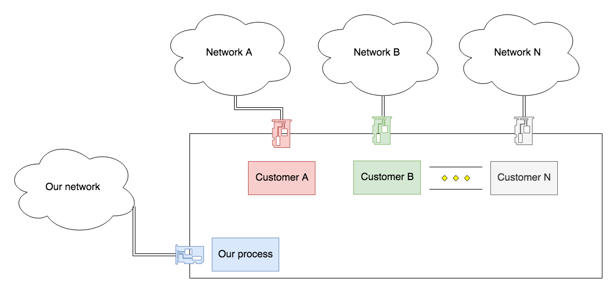

<meta halign="center" valign="center" talign="center">
<meta background="url(title-bg.jpg)" fontcolor="black">

<h1>Least-privileged principals of container security</h1>
<h4>OWASP Bristol - November 2019</h4>

---

<meta footer="Ben Meier - OWASP Bristol - Nov '19">
<meta background="" halign="" valign="" talign="">

## Who I am 🇿🇦

- **Ben**

- Building various distributed, and multi-tenant systems at Oracle's Bristol office

- Currently, **Oracle Cloud Infrastructure** - **API Gateway** and associated things

---

## Why am I here

- I'm definitely on the developer side of things, but from a very full-stack/devops/SRE kind of team

- But with many interests in security topics,

    - Cryptographic systems
    - Process isolation
    - Least privileged applications
    - etc.

- People referenced various containerization things in one of the last OWASP meetups, so I thought I'd share some of the knowledge my team and I have picked up over time

---

<meta halign="center" talign="center">

## ☁️ Challenges when building "clouds" ☁️

Things have to be **cheap** or even **free**, _but still make revenue and even profit!_

/

.. **secure** for governments and healthcare, _but efficient and high-density_.

/

.. **stable** and reliable, _but must failover in a hearbeat to another datacenter_.

/

.. **fast** and dynamic, _but customers also expect resources to stay where they are for months or years_.

Pulling in every direction at once.

---

<meta valign="center" halign="center" talign="center">

---

## Who can you trust?

Customers?

Customers of Customers?

Networks?

Employees?

..

Yourself?

---
<meta valign="" halign="" talign="">

### Container and micro-vm isolation helps us speak a common language

- Many teams follow similar patterns when building their dataplane services

- Isolation at various levels from least to most specific:

    - Network and firewalls
    - Instance (VM)
    - Kernel
    - Container
    - Process

---

## Problem number 1 - potential for bridging networks

- Different processes running on the same machine need to talk over 2-N independent secure networks

---
<meta valign="center" halign="center" talign="left">

## Possible solutions?

1. Don't bother with containers, just use separate VM's in different network boundaries!

2. Sure you can put different tenants on the same VM, but use micro-vm's / Firecracker!

3. 

## Solutions

1. Use separate VM's idiot! (ya right)

- Need to ensure that processes can only route packets over their **dedicated network interfaces**.

- Needs to cover: dhcp, dns, localhost, network sockets

